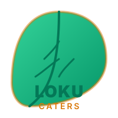
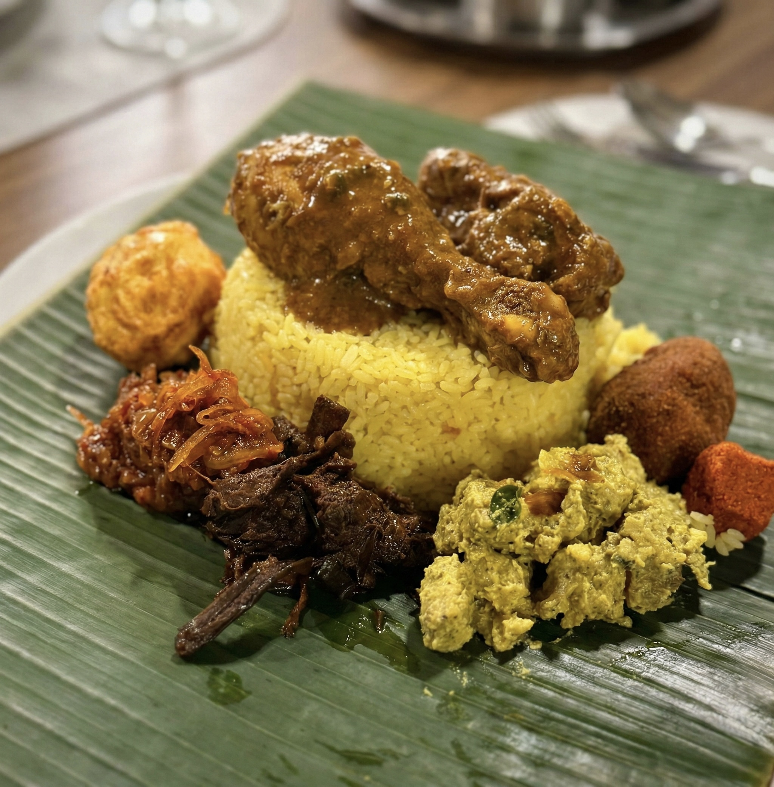

<p align="center">
  
</p>

<h1 align="center">
  <span style="color:#729152">Loku Caters</span>
</h1>

<p align="center">
  <strong>Authentic Sri Lankan Lamprais</strong><br/>
  <em>Heritage Recipes. Small Batches. Made with Love.</em>
</p>

<p align="center">
  
  
  
  
  
</p>

---

## About Loku Caters

A family-run catering business sharing authentic Sri Lankan flavors with the Canadian community. Born from a passion for heritage recipes, we craft each dish with the same love and tradition passed down through generations.

### Our Story

**Chef Jayampathi Lokuliyana** brings over **40 years of culinary expertise** to every plate:

- Trained at La Varenne Ecole de Cuisine (France)
- Thai Cooking School of the Oriental Hotel (Bangkok)
- Culinary leadership experience at Intercontinental, Meridian, Sheraton, and Galle Face Hotel
- Awarded Gold, Silver, and Bronze medals in culinary competitions
- Back by popular demand after a 7-year hiatus to share authentic Sri Lankan flavors

### Our Philosophy

| Principle | Description |
|-----------|-------------|
| **Authenticity First** | In-house roasted spice blends and true Sri Lankan recipes passed down through generations |
| **Quality Over Quantity** | Small batches only. Every dish made fresh and never mass-produced |
| **Community Driven** | Pop-up events and catering services that bring people together |

---

## Featured Dish

### Signature Lamprais

Our signature Lamprais is a celebration of flavors, traditionally wrapped in a banana leaf:

<p align="center">
  
</p>

> **What is inside:** Ghee Rice, Baked Chicken Curry, Fried Boiled Egg, Seeni Sambal, Fricadells (Beef and Pork), Ash Plantain Curry, Brinjal Pahie, and Blachan.

---

## Menu Highlights

### Full-Service Catering

| Menu Style | Perfect For | Key Options |
|------------|-------------|-------------|
| **Standard Menu** | Intimate gatherings | Chicken Curry, Fish Ambulthiyal, Dhal Fry, Bringal Moju |
| **Buffet Style** | Parties and events | Garden Salads, Oven Baked Chicken, Spicy Garlic Prawns, Cream Caramel |
| **Classic Curry** | Customizable spreads | Choice of 3 veggie curries, chicken, fish, and prawn options |
| **International Buffet** | Fusion events | Global salads, pastas, roasted herb potatoes, teriyaki prawns, and main curries |
| **Set Menu** | Fine dining | Roasted Beef Striploin or Oven Baked Salmon with Orange Cream Caramel |

### Individual Orders & Specialties

| Category | Popular Choices |
|----------|-----------------|
| **Rice Dishes** | Chicken Biryani with Raita, Ghee Rice |
| **Appetizers** | Fish Cutlets, Fish Rolls, Mutton Rolls, Chicken Rolls |
| **Kids Menu** | Pasta with Chicken and Rose sauce, Meatballs in Tomato sauce, Chicken Fingers |
| **Desserts** | Pineapple Gateau, Marshmallow Pudding, Cream Caramel, Mango Mousse |
| **Specialty Items** | Traditional Sri Lankan Wedding Cakes |

---

## Platform Features

### Customer Experience

- **Frictionless Pre-Ordering:** A single-page checkout flow optimized for mobile and desktop users.
- **Smart Logistics:** Dynamic location selection with real-time pickup slots based on kitchen capacity.
- **Order Notifications:** Automated transactional emails confirming order details and tracking status.
- **Catering Coordinator:** Dedicated inquiries form for custom catering menu planning.
- **Customer Reviews:** Native feedback system allowing verified buyers to share their dining experience.

### Administrative Command Center

- **Analytics Dashboard:** Real-time metrics on gross revenue, order volume, and menu performance.
- **Lifecycle Management:** End-to-end order tracking from submission to pickup with payment reconciliation.
- **Event Planner:** Dynamic creation and configuration of local pop-up events.
- **Dynamic Inventory:** Live controls for managing menu items, active status, and custom pricing.
- **E-Transfer Reconciliation:** Semi-automated payment tracking and verification workflow.
- **Customer Directory:** Database of customer order history, lifetime value, and contact records.

---

## Configuration-Driven Design

Loku Caters features a config-driven architecture. All event details, menu configurations, location list, pickup windows, and pricing rules are defined in a single source of truth:

- File: `config/event-config.json`

To apply changes to the running system, modify `config/event-config.json` and sync the configuration across the backend and frontend services using the project Makefile:

```bash
make sync-config
```

---

## Tech Stack

The application is built with a modern, high-performance tech stack designed for speed, scalability, and ease of deployment.

### Frontend
- **Framework:** Next.js 15 (TypeScript, App Router)
- **UI Library:** React 19
- **Styling:** Tailwind CSS v4 with CSS custom properties
- **Typography:** Playfair Display (headings) and Inter (body text) via Google Fonts
- **Deployment:** Railway (Dockerized with standalone build output)

### Backend
- **Framework:** FastAPI (Python 3.12)
- **Data Validation:** Pydantic v2 for robust runtime type checking
- **Database ORM:** SQLAlchemy 2.0
- **Database Driver:** pg8000 (Pure-Python driver, avoiding native compilation dependencies)
- **Deployment:** Railway (Dockerized with Uvicorn server)

### Infrastructure & Services
- **Database:** Supabase (Managed PostgreSQL)
- **Email Delivery:** Resend (Python SDK with try-except fallback safety)
- **Hosting:** Railway (Separate frontend and backend services)
- **Repository:** GitHub

---

## Local Development Setup

Follow these steps to run the application locally.

### Prerequisites
- Python 3.12 or higher
- Node.js 18 or higher
- Docker (required for running the local dev database)

### Quick Start (Recommended)

Start the entire stack (local PostgreSQL container, backend service, and frontend development server) with a single command:

```bash
make dev-local
```
This command automatically runs:
1. Local PostgreSQL container on port `5433` (to avoid conflicts with system installations)
2. Database migrations using Alembic
3. Database seeding with comprehensive test data
4. FastAPI backend on `http://localhost:8000` (logs are piped to `/tmp/loku-backend.log`)
5. Next.js dev server on `http://localhost:3000`

### Useful Development Commands

Refer to the project `Makefile` for full task automation:

```bash
# Sync configuration changes across frontend and backend
make sync-config

# Reset the local database (drop schema, run migrations, and re-seed)
make db-reset

# Seed the database with test data
make db-seed

# Stop background backend processes
make stop

# Tail live backend logs
make logs-backend
```

---

## Design System

Our visual identity reflects the rich, natural heritage of Sri Lankan cuisine:

- **Forest Green (`#12270F`):** Brand primary, used for dark layouts and headers.
- **Sage (`#729152`):** Primary accent color, highlights, and calls to action.
- **Cream (`#F7F5F0`):** Brand neutral, used for page backgrounds and dark text contrast.
- **Text Dark (`#1C1C1A`):** High-contrast body text for maximum readability.

---

## Documentation Directory

Explore the detailed technical documentation files:

- [Tech Stack Overview](docs/tech-stack.md)
- [Database Schema](docs/database-schema.md)
- [Menu Configuration](docs/menu.md)
- [Order Flow States](docs/order-flow-states.md)
- [Production Deployment Runbook](docs/prod-deployment-PLAN.md)

---

<p align="center" style="color:#729152; font-size: 0.9em;">
  <strong>Made with love in Canada</strong><br/>
  Bringing authentic Sri Lankan flavors, one lamprais at a time.
</p>

<p align="center">
  
</p>
