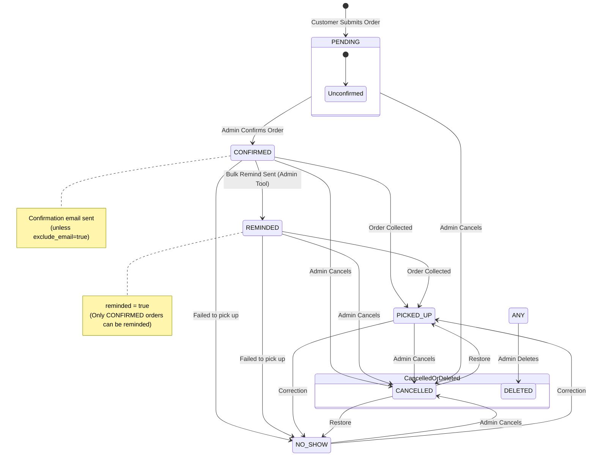
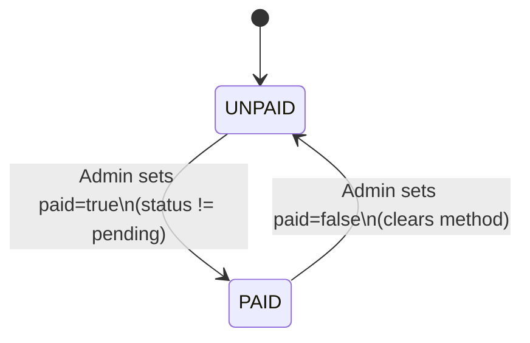

# Order Status State Diagram

The diagram below illustrates the lifecycle of an order in the Loku Caters application, highlighting the primary status transitions and how the `reminded` flag integrates into the flow.

## Status Definitions

| Status | Description |
| :--- | :--- |
| **PENDING** | Initial state. The order has been submitted by the customer but not yet reviewed or confirmed by an admin. |
| **CONFIRMED** | The admin has confirmed the order. This is the stage where the `reminded` flag can be applied. |
| **PICKED_UP** | The final success state. The customer has collected their items. |
| **NO_SHOW** | The customer did not collect their order during their pickup window. |
| **CANCELLED** | The order was cancelled by an admin (or potentially by the system if unpaid/untouched). |

## Integration of the "Reminded" Status

The `reminded` status is a boolean flag (`reminded=true`) that ties into the workflow as a post-confirmation milestone:
- **Prerequisite**: An order must be in the `CONFIRMED` status to receive a reminder. 
- **Trigger**: Sent via the "Bulk Remind" tool in the admin dashboard.
- **Purpose**: Typically used to remind confirmed customers to complete payment (e.g., via e-transfer) or prepare for pickup.
- **Persistence**: Once an order is reminded, it proceeds through the rest of the flow while retaining the flag, allowing admins to track which customers were prompted.

## Payment Tracking (Paid Flag)

Payment is tracked separately from `orders.status`:
- `paid` is a boolean flag that can be toggled by admins without changing `status`.
- When setting `paid=true`, admins must also set a `payment_method` (and optional details for `other`).
- When setting `paid=false`, `payment_method` and `payment_method_other` are cleared.
- Admins can only mark an order as paid once it is no longer `PENDING` (confirm first).

