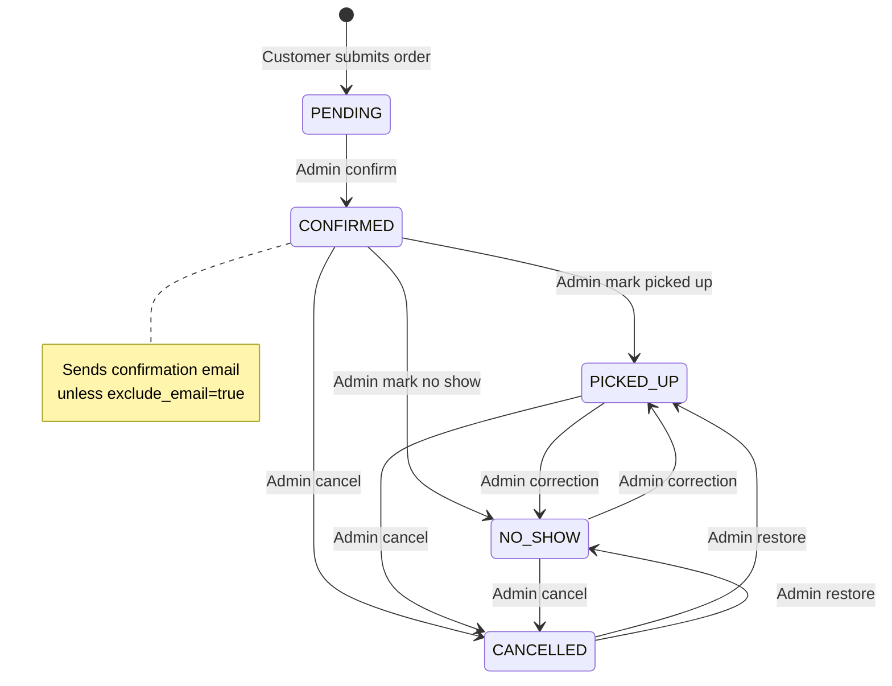
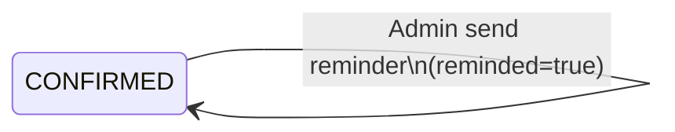

# Order Status State Diagram

This diagram reflects the current bundle-aware admin workflow in Loku Caters.

- Persisted order statuses are `pending`, `confirmed`, `picked_up`, `no_show`, and `cancelled`.
- `reminded` is not a status. It is a boolean flag that can be applied to confirmed bundles.
- Admin actions operate on the full bundle resolved from the selected order line.

```mermaid
stateDiagram-v2
    direction TB

    [*] --> PENDING : Customer submits order

    PENDING --> CONFIRMED : Admin confirm
    note right of CONFIRMED
        Sends confirmation email
        unless exclude_email=true
    end note

    CONFIRMED --> PICKED_UP : Admin mark picked up
    CONFIRMED --> NO_SHOW : Admin mark no show
    CONFIRMED --> CANCELLED : Admin cancel

    PICKED_UP --> NO_SHOW : Admin correction
    PICKED_UP --> CANCELLED : Admin cancel

    NO_SHOW --> PICKED_UP : Admin correction
    NO_SHOW --> CANCELLED : Admin cancel

    CANCELLED --> PICKED_UP : Admin restore
    CANCELLED --> NO_SHOW : Admin restore
```

## Reminder Flag

```mermaid
stateDiagram-v2
    direction LR

    CONFIRMED --> CONFIRMED : Admin send reminder\n(reminded=true)
```

Rules:

- Only confirmed bundles can receive a pickup reminder.
- Reminders are skipped if every line is already `reminded=true`.
- `reminded=true` can persist after later transitions to `picked_up` or `no_show`.

## Mixed Bundle View State

`mixed` is an admin UI aggregation, not a persisted status. It appears when lines inside the same bundle have different persisted statuses.

- Mixed bundles are excluded from table-level bulk status actions.
- New lines cannot be added to a mixed bundle.
- Detail view can still show the bundle breakdown and any safe normalization actions allowed across all lines.

## Payment Flag

Payment remains separate from `status`.

- Bundles cannot be marked paid while status is `pending`.
- Payment reminders are allowed for unpaid `confirmed` and `picked_up` bundles.
- Adding a new line to an existing bundle resets bundle payment state to unpaid.
